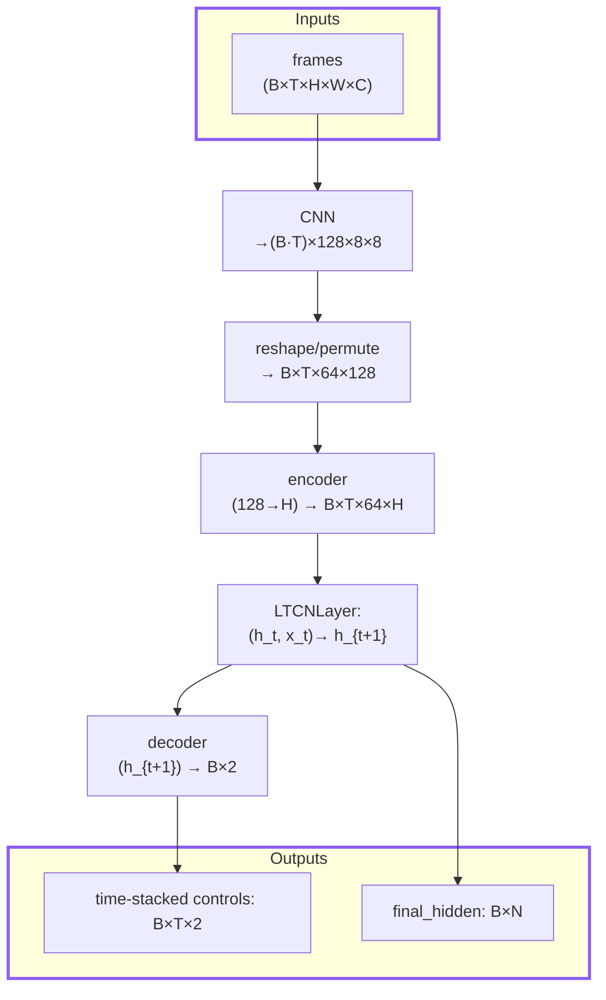
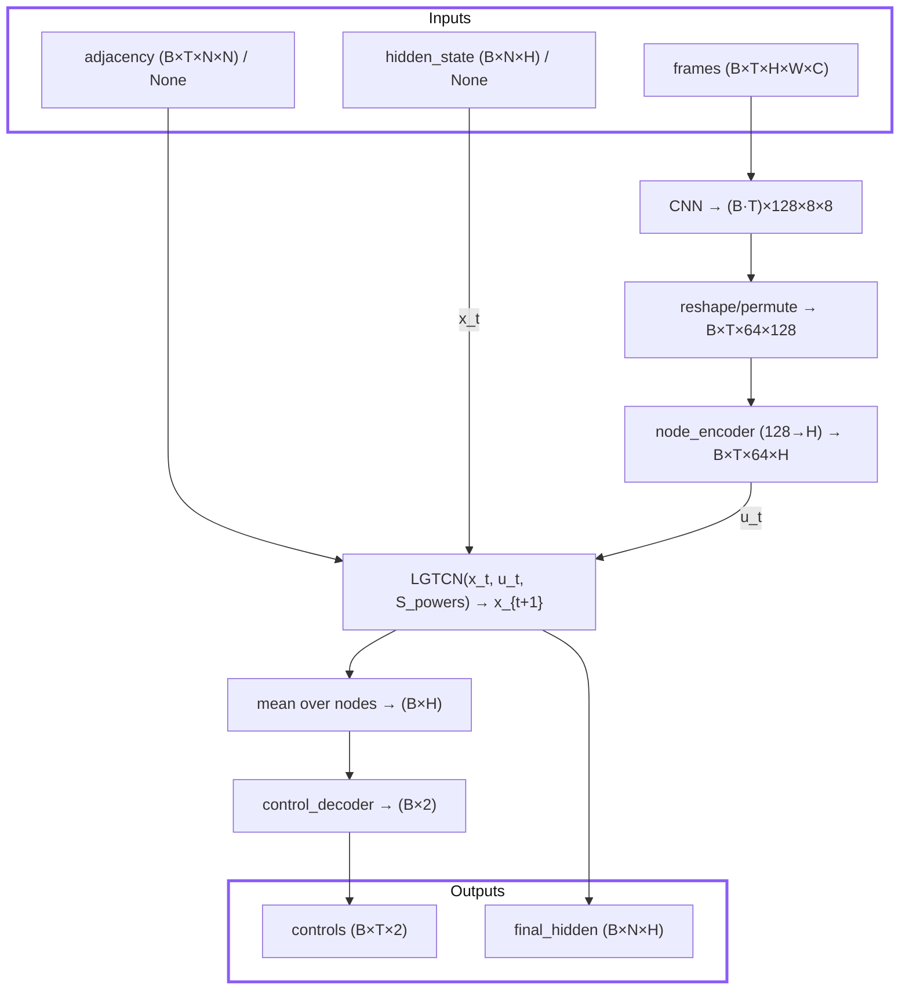

# Liquid-Graph Time-Constant Network (LGTC network)
This repository provides a reference implementation of the Liquid-Graph Time-Constant (LGTC) networks introduced in the paper “[Liquid-Graph Time-Constant Network for Multi-Agent Systems Control](https://arxiv.org/pdf/2404.13982)” .

# Getting started
Set up the project with **either** of the following methods, depending on the tools you prefer.
### 1. pip + venv
```bash
git clone https://github.com/satra-11/liquid-graph-time-constant-network .
python -m venv .venv
source .venv/bin/activate
pip install -r requirements.lock
```
### 2. Rye
```bash
git clone https://github.com/satra-11/liquid-graph-time-constant-network .
rye sync
```
# Commands
### 1. Training
Start training by executing a command below. The results are generated at /driving_results folder.
```bash
python3 ./src/scripts/train_driving.py
```

# Model Structures

The `scripts/train_driving.py` script follows the workflow below to train and evaluate the LGTCN and LTCN models.
### LTCN Model



