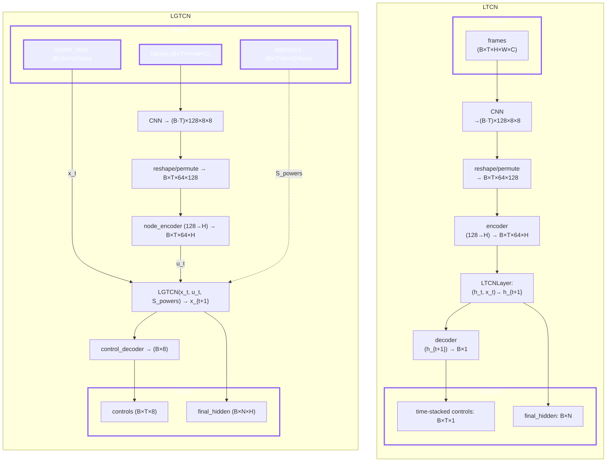

# Liquid-Graph Time-Constant Network (LGTC network)
This repository provides a reference implementation of the Liquid-Graph Time-Constant (LGTC) networks introduced in the paper “[Liquid-Graph Time-Constant Network for Multi-Agent Systems Control](https://arxiv.org/pdf/2404.13982)” .

# Getting started
Set up the project with **either** of the following methods, depending on the tools you prefer.
### 1. pip + venv
```bash
git clone https://github.com/satra-11/liquid-graph-time-constant-network
cd liquid-graph-time-constant-network
python -m venv .venv
source .venv/bin/activate
pip install -r requirements.lock
```
### 2. uv
```bash
git clone https://github.com/satra-11/liquid-graph-time-constant-network
cd liquid-graph-time-constant-network
uv sync
```
# Commands
## 1. Feature Extraction (Optional but Recommended)
To speed up training, you can pre-compute CNN features from the raw images.
```bash
python3 scripts/extract_features.py
```
This will read images from `/data/raw` and save `.npy` features to `/data/processed`.

## 2. Training
Start training by executing the command below. The results will be generated in the `/driving_results` folder by default.
```bash
python3 scripts/train_driving.py
```

### Command-Line Arguments
You can customize the training process using the following arguments:
| Argument | Type | Default | Description |
|:---|:---|:---|:---|
| `--seed` | int | 42 | Random seed for reproducibility. |
| `--sequence-length` | int | 20 | Length of the input sequences. |
| `--batch-size` | int | 32 | Batch size for training. |
| `--epochs` | int | 50 | Number of training epochs. |
| `--lr` | float | 1e-3 | Learning rate for the optimizer. |
| `--hidden-dim` | int | 64 | Dimension of the hidden states in the models. |
| `--K` | int | 2 | Neighborhood size (K-hop) for the LGTCN graph filter. |
| `--data-dir` | str | `/data/raw` | Path to the directory containing the raw dataset. |
| `--processed-dir` | str | `/data/processed` | Path to the directory containing processed features. |
| `--save-dir` | str | `./driving_results` | Directory to save training results. |
| `--device` | str | `auto` | Device to use for training (`auto`, `cpu`, `cuda`). |

*Note: `--num-sequences`, `--corruption-rate`, and `--sensor-sequence` are defined but not currently used in the script.*

## 2. Evaluation
The training script automatically runs an evaluation on the test set after training is complete. The evaluation compares the models' robustness against different levels of input corruption (whiteout noise).

## 3. Monitoring with MLflow
You can monitor the training progress and view the results using MLflow.
To start the MLflow UI, run the following command in the project root directory:

```bash
uv run mlflow ui
```

Then, open your browser and navigate to `http://localhost:5000`.
You will be able to see:
- **Experiments**: Training runs and their status.
- **Metrics**: Real-time plots of training and validation loss.
- **Artifacts**: Saved models (`.pth`), training curves, and comparison plots.

# Tasks
## Self-Driving
This task involves predicting the vehicle's control signals from camera images. The model is trained to output the following 6 CAN bus data signals:

-   **`accel_pedal_info`**: Accelerator pedal depression (0 to 1)
-   **`brake_pedal_info`**: Brake pedal force or ratio
-   **`steer_info`**: Steering angle or torque
-   **`vel_info`**: Vehicle speed
-   **`yaw_info`**: Yaw rate
-   **`turn_signal_info`**: Turn signal (left/right)

# Results
After running the training script, the following files will be generated in the specified `--save-dir`:

-   `lgtcn_model.pth` / `ltcn_model.pth`: The trained weights for the LGTCN and LTCN models.
-   `training_curves.png`: A plot showing the training and validation loss curves for both models.
-   `training_info.json`: A JSON file containing the training arguments and the loss history for each epoch.
-   `comparison_plots.png`: Plots comparing the performance (MSE, MAE) of LGTCN and LTCN under various levels of input corruption.
-   `comparison_results.json`: Detailed numerical results from the comparative evaluation.

# Directory Structure
```yaml
├───pyproject.toml
├───README.md
├───requirements-dev.lock
├───requirements.lock
├───driving_results/
├───data/
│   ├───raw/       # Raw HDD dataset
│   └───processed/ # Pre-computed CNN features
├───scripts/
├───src/
│   ├───layers/
│   ├───models/
│   ├───tasks/
│   └───utils/
└───test/
```
※ For HDD see [here](https://github.com/satra-11/liquid-graph-time-constant-network/blob/main/README.md#dataset).
# Model Structures

The `scripts/train_driving.py` script follows the workflow below to train and evaluate the LGTCN and LTCN models.


# Dataset

This project utilizes the [Honda Research Institute Driving Dataset (HDD)](https://usa.honda-ri.com/datasets) for training and evaluation.The data can be obtained [here](https://usa.honda-ri.com/hdd).

The scripts expect the dataset to be organized in the `/data` directory with the following structure:

```
/data/
├───raw/
│   ├───camera/
│   │   ├───<sequence_0>/
│   │   │   ├───00000.jpg
│   │   │   └───...
│   │   └───<sequence_n>/
│   └───sensor/
│       ├───<sequence_0>.npy
│       └───<sequence_n>.npy
└───processed/
    ├───<sequence_0>.npy
    └───<sequence_n>.npy
```
