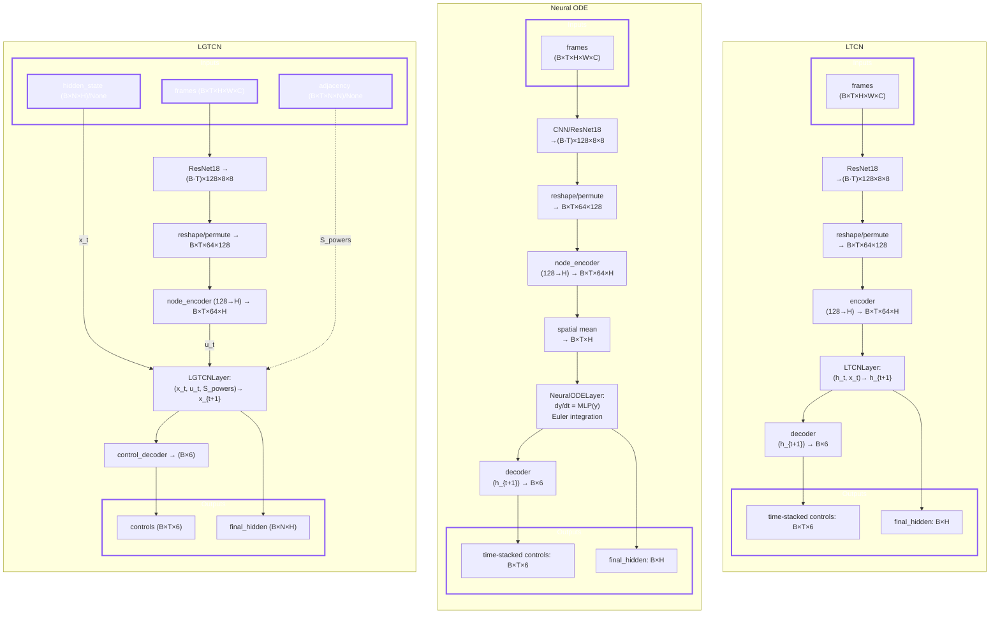
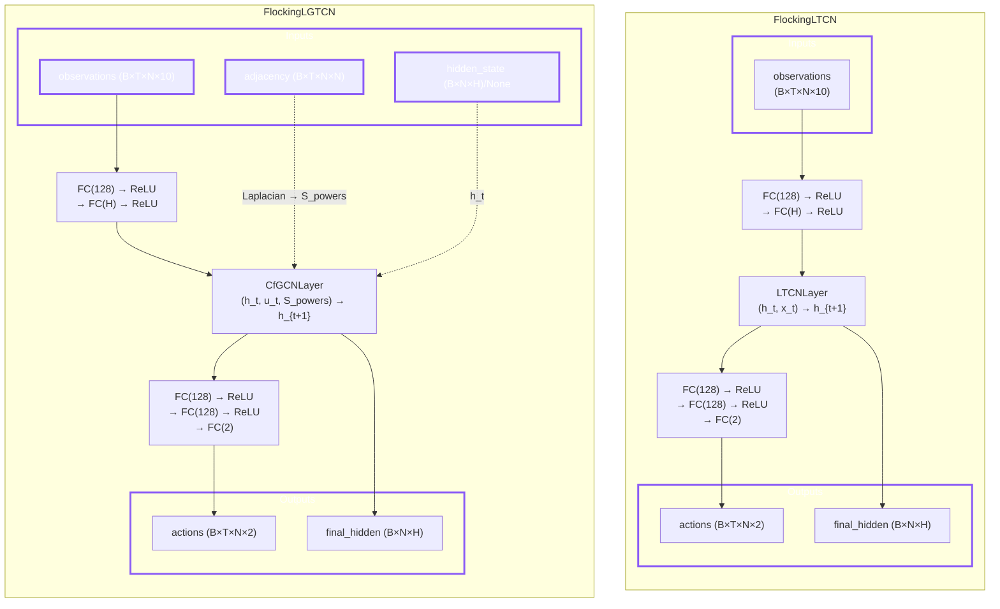

# Liquid-Graph Time-Constant Network (LGTC network)

This repository provides a reference implementation of the Liquid-Graph Time-Constant (LGTC) networks introduced in the paper “[Liquid-Graph Time-Constant Network for Multi-Agent Systems Control](https://arxiv.org/pdf/2404.13982)”.

## Getting started

Set up the project with **either** of the following methods, depending on the tools you prefer.

### 1. pip + venv

```bash
git clone [https://github.com/satra-11/liquid-graph-time-constant-network](https://github.com/satra-11/liquid-graph-time-constant-network)
cd liquid-graph-time-constant-network
python -m venv .venv
source .venv/bin/activate
pip install -r requirements.lock
````

### 2\. uv

```bash
git clone [https://github.com/satra-11/liquid-graph-time-constant-network](https://github.com/satra-11/liquid-graph-time-constant-network)
cd liquid-graph-time-constant-network
uv sync
```

### 3\. Using Makefile

This project includes a Makefile to simplify common tasks. Run `make help` to see all available commands:

```bash
make help
```

| Command | Description |
|:---|:---|
| `make install` | Install dependencies (production only) |
| `make install-dev` | Install all dependencies including dev tools |
| `make sync` | Sync dependencies using uv |
| `make lint` | Run linting (ruff, mypy) |
| `make test` | Run tests with pytest |
| `make extract` | Extract features from raw images |
| `make train` | Train the driving models |
| `make evaluate` | Evaluate trained models |
| `make flocking` | Run the flocking task |
| `make mlflow` | Start MLflow UI |
| `make clean` | Remove cache files |
| `make all` | Run full pipeline (extract → train) |

-----

## Commands

### 1\. Feature Extraction (Optional but Recommended)

To speed up training, you can pre-compute features using a pre-trained ResNet18 backbone. This process extracts high-level semantic features from raw images and reduces them to a compact representation.

```bash
python3 scripts/extract_features.py
```

This will read images from `/data/raw` and save `.npy` features to `/data/processed`.

### 2\. Training

Start training by executing the command below. The results will be generated in the `/driving_results` folder by default.

```bash
python3 scripts/train_driving.py --model lgtcn
```

#### Command-Line Arguments

You can customize the training process using the following arguments:

| Argument | Type | Default | Description |
|:---|:---|:---|:---|
| `--model` | str | **Required** | Model to train: `lgtcn`, `ltcn`, `node`, `ngode`. |
| `--seed` | int | 42 | Random seed for reproducibility. |
| `--sequence-length` | int | 20 | Length of the input sequences. |
| `--batch-size` | int | 500 | Batch size for training. |
| `--epochs` | int | 100 | Number of training epochs. |
| `--lr` | float | 1e-3 | Learning rate for the optimizer. |
| `--hidden-dim` | int | 64 | Dimension of the hidden states in the models. |
| `--K` | int | 2 | Neighborhood size (K-hop) for the LGTCN graph filter. |
| `--data-dir` | str | `/data/raw` | Path to the directory containing the raw dataset. |
| `--processed-dir` | str | `/data/processed` | Path to the directory containing processed features. |
| `--save-dir` | str | `./driving_results` | Directory to save training results. |
| `--device` | str | `auto` | Device to use for training (`auto`, `cpu`, `cuda`). |

*Note: `--num-sequences`, `--corruption-rate`, and `--sensor-sequence` are defined but not currently used in the script.*

### 3\. Evaluation

After training, you can evaluate the models on the test set to measure robustness against different levels of input corruption (whiteout noise).

```bash
python3 scripts/evaluate_driving.py --model ltcn --data-dir ./data/raw --model-path ./driving_results/LTCN_checkpoint.pth
```

### 4\. Monitoring with MLflow

You can monitor the training progress and view the results using MLflow.
To start the MLflow UI, run the following command in the project root directory:

```bash
uv run mlflow ui --port 5001
```

Then, open your browser and navigate to `http://localhost:5001`.
You will be able to see:

  - **Experiments**: Training runs and their status.
  - **Metrics**: Real-time plots of training and validation loss.
  - **Artifacts**: Saved models (`.pth`), training curves, and comparison plots.

-----

## Tasks

### Self-Driving

This task involves predicting the vehicle's control signals from camera images. The model is trained to output the following 6 CAN bus data signals:

  - **`accel_pedal_info`**: Accelerator pedal depression (0 to 1)
  - **`brake_pedal_info`**: Brake pedal force or ratio
  - **`steer_info`**: Steering angle or torque
  - **`vel_info`**: Vehicle speed
  - **`yaw_info`**: Yaw rate
  - **`turn_signal_info`**: Turn signal (left/right)

### Flocking (Multi-Agent Control)

This task implements **Leader-Follower Flocking** simulation for multi-agent systems, based on the LGTCN paper's experimental conditions ([arXiv:2404.13982](https://arxiv.org/abs/2404.13982)).

The model learns to imitate an expert controller (Olfati-Saber式) that coordinates multiple agents to follow a leader toward a target while avoiding collisions.

  - **Input**: Position `r(t) ∈ R^(N×2)` and velocity `v(t) ∈ R^(N×2)` for N agents
  - **Output**: Acceleration `u(t) ∈ R^(N×2)` for each agent
  - **Training**: Imitation learning with DAGGER algorithm for distribution shift correction

#### Running the Flocking Task

```bash
python -m src.flocking.run
```

#### Command-Line Arguments

| Argument | Type | Default | Description |
|:---|:---|:---|:---|
| `--num-trajectories` | int | 60 | Number of training trajectories. |
| `--trajectory-length` | float | 2.5 | Trajectory duration in seconds. |
| `--dt` | float | 0.05 | Sampling time in seconds. |
| `--agent-counts` | int[] | [4, 6, 10, 12, 15] | Possible agent counts (randomly selected). |
| `--comm-range` | float | 4.0 | Communication range R in meters. |
| `--collision-range` | float | 1.0 | Collision avoidance range R_CA in meters. |
| `--max-accel` | float | 5.0 | Maximum acceleration in m/s². |
| `--hidden-dim` | int | 48 | Hidden state dimension F. |
| `--K` | int | 2 | Filter length for graph convolution. |
| `--epochs` | int | 100 | Number of training epochs. |
| `--batch-size` | int | 8 | Batch size. |
| `--lr` | float | 1e-3 | Learning rate. |
| `--dagger-interval` | int | 20 | Run DAGGER data collection every N epochs. |
| `--dagger-trajectories` | int | 10 | Number of trajectories to add per DAGGER. |
| `--num-layers` | int | 1 | Number of CfGCN layers (FlockingLGTCN). |
| `--num-blocks` | int | 4 | Number of blocks in LTCN layer (FlockingLTCN). |
| `--save-dir` | str | `flocking_results` | Directory to save results. |

-----

## Model Structures

The `scripts/train_driving.py` script follows the workflow below to train and evaluate the LGTCN, LTCN, and Neural ODE models.



### Flocking Models

The flocking models use a simpler architecture since the input is already structured as agent observations (position, velocity, etc.) rather than raw images.



**Key Differences:**
- **FlockingLGTCN**: Uses `CfGCNLayer` with normalized Laplacian for graph-based message passing between agents. Agents share information within communication range.
- **FlockingLTCN**: Each agent is processed independently with shared weights. No inter-agent communication.

### Numerical Integration

All models (LTCN, LGTCN, Neural ODE) use **Euler integration** for solving ODEs:

```python
# Euler method: y_{n+1} = y_n + dt * f(y_n)
for _ in range(n_steps):
    dydt = ode_func(y)
    y = y + dt * dydt
```

This unified integration scheme ensures **fair comparison** across models. Using different solvers (e.g., adaptive Runge-Kutta for Neural ODE vs. Euler for LTCN) would introduce confounding variables, making it impossible to attribute performance differences solely to the model architecture.

| Model | ODE Dynamics | Integrator |
|:------|:-------------|:-----------|
| LTCN | LTC dynamics with decay and gating | Euler |
| LGTCN | Graph-filtered LTC dynamics | Euler |
| Neural ODE | MLP-based `dy/dt = f(y)` | Euler |

## Results

After running the training script, the following files will be generated in the specified `--save-dir`:

  - `lgtcn_model.pth` / `ltcn_model.pth`: The trained weights for the LGTCN and LTCN models.
  - `training_curves.png`: A plot showing the training and validation loss curves for both models.
  - `training_info.json`: A JSON file containing the training arguments and the loss history for each epoch.
  - `comparison_plots.png`: Plots comparing the performance (MSE, MAE) of LGTCN and LTCN under various levels of input corruption.
  - `comparison_results.json`: Detailed numerical results from the comparative evaluation.

-----

## Directory Structure

```yaml
├───pyproject.toml
├───README.md
├───requirements-dev.lock
├───requirements.lock
├───driving_results/
├───data/
│   ├───raw/       # Raw HDD dataset
│   └───processed/ # Pre-computed CNN features
├───scripts/
├───src/
│   ├───core/      # Core model components
│   │   ├───layers/
│   │   └───models/
│   ├───driving/   # Driving task
│   ├───flocking/  # Flocking task
│   ├───tasks/     # Analysis tasks
│   └───utils/
└───test/
```

※ For HDD see [Dataset](https://www.google.com/search?q=%23dataset) section below.

-----

## Dataset

This project utilizes the [Honda Research Institute Driving Dataset (HDD)](https://usa.honda-ri.com/datasets) for training and evaluation. The data can be obtained [here](https://usa.honda-ri.com/hdd).

The scripts expect the dataset to be organized in the `/data` directory with the following structure:

```
/data/
├───raw/
│   ├───camera/
│   │   ├───<sequence_0>/
│   │   │   ├───00000.jpg
│   │   │   └───...
│   │   └───<sequence_n>/
│   └───sensor/
│       ├───<sequence_0>.npy
│       └───<sequence_n>.npy
└───processed/
    ├───<sequence_0>.npy
    └───<sequence_n>.npy
```
